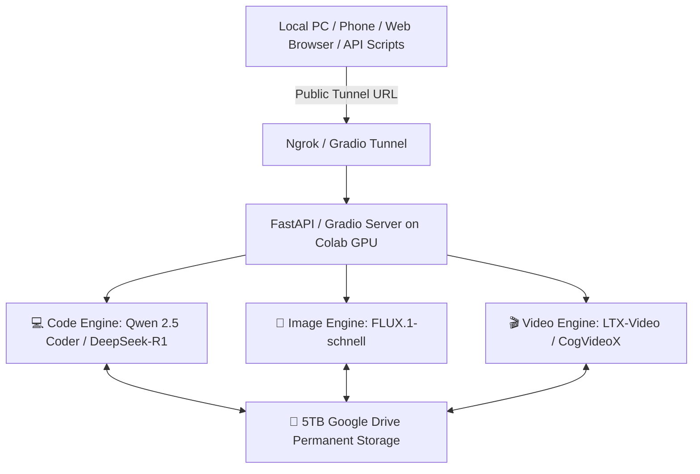

# 📌 PLAN.md: Single Source of Truth for Unified Free AI Studio

**Project Name:** Unified Free AI Studio (Code + Image + Video + Automation Engine)  
**Location:** `/home/ubuntu_16gb/raj_work_space/funzone`  
**Created Date:** 2026-08-20  
**Target Environment:** Google Colab Cloud GPU (T4 / L4 / A100) + 5TB Google Drive Storage  

---

## 🎯 1. Project Goal & Vision
Create an end-to-end **100% Free, Automated Multi-Modal AI Studio** that requires zero local PC hardware load. It will generate high-quality code, photorealistic images, and HD video clips, accessible via a Web UI and automated REST APIs.

---

## 🏗️ 2. System Architecture



---

## 🧩 3. Detailed Component Specifications

### 💻 Component A: Text, Code & Multilingual Reasoning Engine
- **Primary Models:** `DeepSeek-R1-Distill-Qwen-14B` / `Qwen-2.5-14B-Instruct` (GGUF Q4_K_M)
- **Engine Framework:** `llama-cpp-python` with CUDA acceleration.
- **Capabilities:** Full-stack coding, Hindi & Hinglish multilingual natural response, step-by-step reasoning, JSON generation.

### 🎨 Component B: Image Generation Engine
- **Primary Model:** `FLUX.1-schnell` (by Black Forest Labs)
- **Engine Framework:** Hugging Face `diffusers` + PyTorch CUDA.
- **Functionality:** 1024x1024 HD image rendering in < 8 seconds, photorealistic scenes, text rendering in images.

### 🎬 Component C: Video Generation Engine
- **Primary Model:** `LTX-Video` / `CogVideoX-2B`
- **Engine Framework:** Diffusers Video Pipeline + PyTorch CUDA.
- **Functionality:** Prompt-to-Video generation (MP4 output, 24fps, high motion quality).

### ⚙️ Component D: Automation API & Tunnel
- **Web Interface:** Gradio 3-Tab Interface (Code | Image | Video).
- **Automation Backend:** FastAPI REST endpoints (`/generate/code`, `/generate/image`, `/generate/video`).
- **Tunneling:** Ngrok / Gradio Share URL for remote access anywhere.

---

## 📂 4. Project Directory Structure

```text
/home/ubuntu_16gb/raj_work_space/funzone/
├── plan.md                           # Single Source of Truth (THIS FILE)
├── DEPLOYMENT_GUIDE.md               # 1-Click Launch Guide for Colab & Drive
├── conversations/                    # Session logs & milestone documentation
│   ├── session_01.md
│   └── session_02.md
├── notebooks/
│   └── ai_studio_master.ipynb        # Master Colab Notebook for deployment
├── scripts/
│   ├── config.py                     # Path configuration & settings
│   ├── drive_manager.py              # Download & sync models to Google Drive
│   ├── sync_drive.py                 # Secure Google Drive OAuth live sync
│   ├── code_engine.py                # DeepSeek / Qwen execution wrapper
│   ├── image_engine.py               # FLUX.1 image generator wrapper
│   ├── video_engine.py               # Video generator wrapper
│   └── server_api.py                 # FastAPI + Gradio server script
└── requirements.txt                  # Python dependencies list
```

---

## 🪜 5. Strict 8-Step Implementation Roadmap

- [x] **Step 0: Create `plan.md` & Setup Architecture Blueprint** *(Completed)*
- [x] **Step 1: Setup Conversation Logging & Folder Structure** *(Completed)*
- [x] **Step 2: Build `notebooks/ai_studio_master.ipynb` Master Colab Template** *(Completed)*
- [x] **Step 3: Build `scripts/drive_manager.py` (Automated Model Downloader to Google Drive)** *(Completed)*
- [x] **Step 4: Implement Engine 1 - Text, Code & Hinglish LLM Engine (`scripts/code_engine.py`)** *(Completed)*
- [x] **Step 5: GitHub Live Code Auto-Sync Integration** *(Completed)*
- [x] **Step 7: Build Unified Web UI & Automation REST API (`scripts/server_api.py`)** *(Completed)*
- [ ] **Step 8: Final Testing, Verification & Automation Guide**

---

## 🚫 6. Anti-Hallucination Guardrails & Operating Rules
1. **One Step at a Time:** Strictly execute and verify one step before proceeding to the next.
2. **Permanent Source of Truth:** Never deviate from `plan.md` specifications without user confirmation.
3. **Log Every Progress:** Update `conversations/` after every major milestone.
4. **Colab Compatibility:** Ensure all Python dependencies are verified for Google Colab GPU environment.
